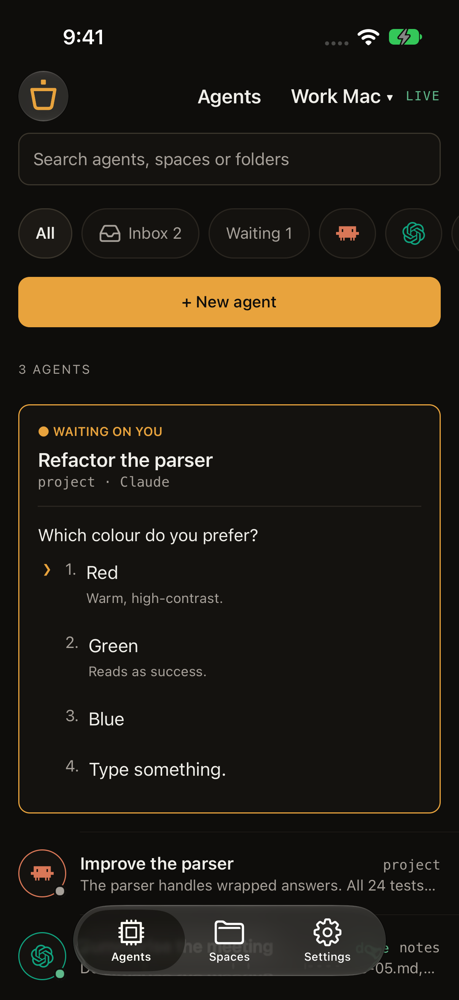
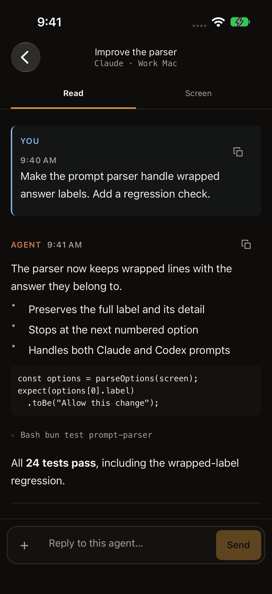
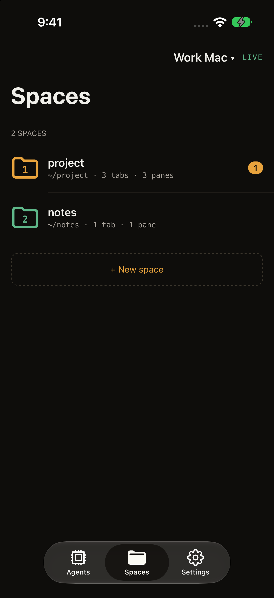
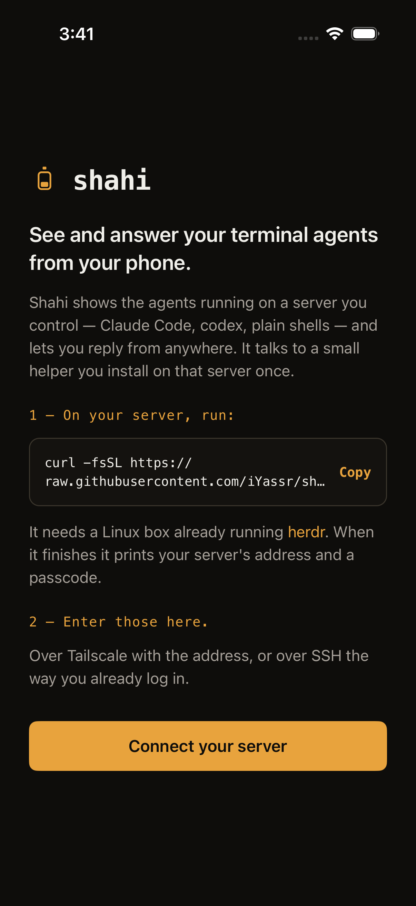
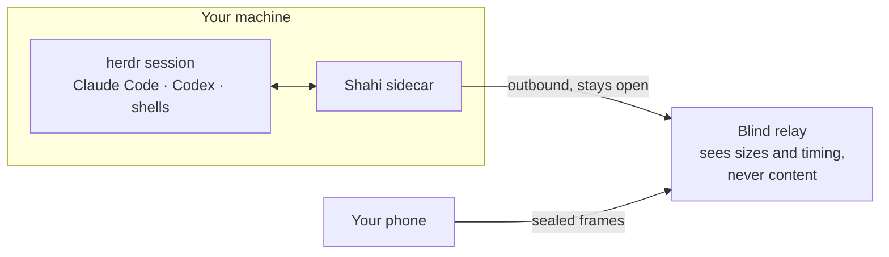

<div align="center">

# Shahi

**See and answer your terminal agents from your phone.**

Claude Code, Codex, and every agent running in [herdr](https://herdr.dev),
in one calm mobile inbox — the real conversation, not a shrunken terminal.

[](https://github.com/iYassr/shahi/actions/workflows/ci.yml)
[](LICENSE)


[Quick start](#quick-start) · [How it connects](#how-it-connects) ·
[Security](#private-by-design) · [Docs](#documentation)

</div>

---

## The problem

Agents stop. Claude Code hits a permission prompt, Codex asks which option you
meant, a long run finishes and waits. Each one blocks until you are back at your
desk — and you find out by walking over and checking.

Shahi turns that wait into a notification you can answer from your pocket.

<p align="center">
  
  
  
  
</p>
<p align="center">
  <sub><b>Agents</b> — what needs you · <b>Reader</b> — the real conversation ·
  <b>Spaces</b> — the map · <b>Connect</b> — scan once</sub>
</p>

## Quick start

On the machine where herdr runs:

```sh
herdr plugin install iYassr/shahi
herdr plugin action invoke shahi.pair
```

That installs the sidecar as a user service, generates its secrets, and prints a
QR code. Scan it in the app and your agents appear.

There is nothing else to configure — no port to forward, no domain, no reverse
proxy. Reinstalling upgrades in place and keeps your passcode.

No herdr yet? `curl -fsSL https://herdr.dev/install.sh | sh` first — Shahi is a
herdr plugin, so herdr comes first and there is no separate Shahi installer.

> [!NOTE]
> The iOS app is in private testing; there is no public App Store or TestFlight
> link yet. The sidecar, plugin, relay and full source are ready to evaluate
> today.

## How it connects

Your machine dials **out** to a relay and holds the connection open. Your phone
dials out to the same relay. Neither side needs an inbound port, and the relay
cannot read what it forwards.



Every frame above the relay is sealed end to end between phone and sidecar
(X25519 → HKDF → ChaCha20-Poly1305), keyed from the pairing secret, which never
travels. The relay multiplexes ciphertext and knows a key hash, not who you are.

Two alternatives, if you would rather not use a relay at all:

| Mode | Reach | Set-up |
|---|---|---|
| **Relay** (default) | Anywhere | None — the first QR just works |
| **Direct** | Your tailnet | Tailscale on both devices |
| **SSH tunnel** | Anywhere you can SSH | Host key pinned on first connect |

`RELAY_URL=` (empty) in the plugin's config opts out of the relay entirely.

## What makes it different

**It reads the transcript, not the screen.** Claude Code and Codex each write a
structured log of the real conversation. Shahi reads that on your machine and
renders messages, reasoning, tool calls, patches, files and results as a
phone-shaped thread. Terminal text arrives hard-wrapped at 146 columns and
cannot be reflowed — which is why every "mobile tmux" is a pinch-and-scroll
exercise, and why Shahi does not try to be one.

**Permission prompts become buttons.** When an agent renders a menu, Shahi
parses it and offers the real choices, with the context above them. A prompt is
answered by the server against a fresh read of the screen, so a stale tap
cannot press the wrong row. When the parse is not confident, you get the raw
terminal and a text box instead of invented buttons.

**Unknown shapes are dropped, never guessed.** An agent output Shahi does not
recognise renders nothing rather than something plausible and wrong. The failure
mode is silence, not fiction.

**Full control stays one tap away.** Reply, answer, attach a file, send terminal
keys, start a new agent in any workspace, or drop to the raw screen.

**It runs on your machine.** Your agents, code, credentials and transcripts stay
on hardware you own.

## Private by design

Shahi can type into your terminal, so the boundary is deliberate rather than
incidental:

- The sidecar binds to loopback and is gated by a passcode.
- Pairing codes are single-use and expire in ten minutes. Each paired device
  gets its own secret and can be revoked — effective on its next request and on
  its open socket.
- The relay is blind: it forwards sealed frames and can observe sizes and
  timing, never content, paths, or keys.
- Secrets live in herdr's per-plugin config directory, never in the checkout.
  On the phone they live in the iOS Keychain.
- Terminal output is never written to logs.

The threat model, the protocol, and what is fixed versus accepted are written
down in the [security review](docs/security-review.md) and
[relay specification](docs/relay.md) — including the parts that are still open.

## Requirements

- A Mac or Linux machine running **herdr 0.8.2+**
- Claude Code, Codex, or any shell running inside it
- An iPhone
- Outbound internet for the default relay — or Tailscale, or SSH

herdr is the only backend today. tmux is plausible and not built; it is not
advertised as working.

## Development

A native Expo app, a Bun sidecar, a shared wire contract, and a Cloudflare
Worker relay.

```text
mobile/   the native app — the product, and where new work goes
server/   the sidecar: owns herdr's socket, speaks HTTP + WebSocket
shared/   the wire contract, relay protocol, end-to-end encryption
relay/    the blind relay: a Worker, one Durable Object per box
plugin/   the herdr plugin and its service lifecycle
web/      the archived PWA — kept working, no longer developed
e2e/      Playwright, against a stub of the server
```

```sh
bun install
bun run typecheck
bun test shared/src server web/src plugin   # unit
bun run test:mobile                         # the app
bun run test:e2e                            # both engines, against a stub
bun run test:relay                          # the relay, under wrangler dev
```

Tests run against a stub that records writes instead of performing them, so the
suite can never type into a real session. CI additionally runs the sidecar
against a **real headless herdr** on every push — pinned to 0.8.2 and to
whatever is current — because contract drift is the one thing a stub cannot
notice.

[CLAUDE.md](CLAUDE.md) documents herdr's measured behaviour and the engineering
rules; read [CONTRIBUTING.md](CONTRIBUTING.md) before opening a change.

## Documentation

| | |
|---|---|
| [Plugin and pairing](docs/plugin.md) | Install, actions, key bindings, uninstall |
| [Connection options](docs/connectivity.md) | Relay, tailnet, SSH — and how to choose |
| [Relay protocol](docs/relay.md) | The wire format, and running your own |
| [Security review](docs/security-review.md) | Threat model, findings, what is deferred |
| [Operating the sidecar](docs/operations.md) | Service, logs, manual setup |
| [Notifications](docs/notifications.md) | Push, and what is not proven yet |
| [Building on a Mac](docs/on-a-mac.md) | iOS builds and device testing |
| [Privacy policy](docs/privacy-policy.md) | Draft, for the App Store |

---

<div align="center">
<sub>MIT licensed · Shahi was HerdrUI until August 2026 — a phone-shaped window
onto a terminal multiplexer need not be named after one.</sub>
</div>
