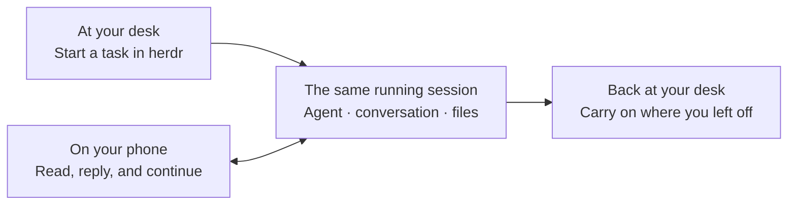
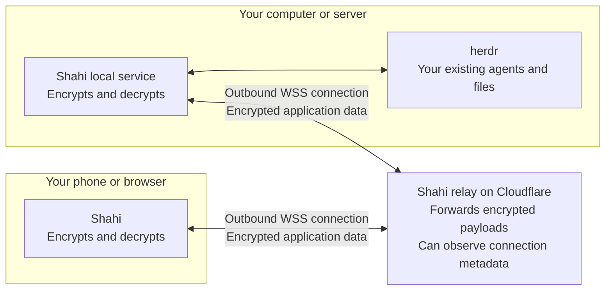

<div align="center">


# Shahi

**Your herdr agents, as a chat on your phone.**

Not a terminal squeezed onto a small screen: Shahi turns the Claude Code, Codex<br>
and Cursor sessions running in herdr into a conversation you read, answer and steer with your thumb.

**Two commands, one scan, about a minute.** End-to-end encrypted. No account, VPN or open port.

[](https://github.com/iYassr/shahi/actions/workflows/ci.yml)
[](LICENSE)

[Open Shahi](https://getshahi.dev/pwa/) · [Request an iOS beta invite](https://getshahi.dev/#ios-beta) · [Quick start](#quick-start) · [Connection security](#connection-security)

</div>

## Your work stays where you started it

You start a task with Claude Code or Codex on your computer or server. Then you
step away. An agent needs permission, has a question, or finishes something you
want to review.

Open Shahi on your phone and pick up that same session. Read the conversation,
answer the question, send the next instruction, or open the terminal screen.
When you return to your computer, your replies and the agent’s work are already
there.

**Shahi connects you to the work that is already running.** There is no project
to upload or conversation to recreate. Your agents, files, and commands stay on
your machine, inside [herdr](https://herdr.dev).



Your computer or server must stay awake and connected. Closing Shahi on your
phone does not stop the agents running there.

## Why not just a terminal app?

A terminal on a phone is a poor way to talk to an agent. SSH apps show output
wrapped for a wide screen, so you pinch, scroll sideways and hunt for Esc and
Tab. Shahi reads each agent’s own transcript instead, so messages, tool
calls and diffs fit your screen, and supported permission prompts become buttons.
It feels like texting. The terminal is still one tap away, on the Screen tab.

Shahi is built on [herdr](https://herdr.dev), a lightweight home for your agents
with spaces, panes and live status for each one. Shahi mirrors all of it, so you
can browse spaces and start new agents from your phone.

## A herdr client made for your phone

Shahi brings your running agents into an interface designed for a small screen:
clear conversations, readable code, colored agent icons, and controls that are
easy to reach. Live updates keep you close to the work; returning to a conversation
keeps your reading position and unfinished reply.

Claude Code and Codex activity is formatted automatically. Messages, tool calls,
command results, file changes and supported approval requests become readable
conversation items, so you can understand what happened and decide what comes
next from your phone. There is no per-tool layout to configure. Screen mode is
always available for the terminal itself; unfamiliar agent output may need that
view rather than a formatted conversation.

- **Scan and connect.** The default connection uses a pairing QR code. No Shahi
  account, public server port, VPN installation, or domain setup is needed.
- **Read comfortably.** Conversation view formats messages, code, tool calls,
  and results for a small screen. Screen mode shows the underlying terminal.
- **Keep work moving.** Answer supported permission prompts inline, send a
  follow-up, attach a file, or use terminal keys your phone keyboard lacks.
- **Find what needs you.** The Inbox in Agents gathers unanswered requests,
  completed work, and agents whose status needs checking. Mark completed items
  Reviewed for the current app session. Search by conversation name, space or
  folder to find earlier work quickly.
- **Know when the connection is interrupted.** Connection guidance distinguishes
  reported network, relay, and computer-disconnection problems and offers a
  retry while preserving the last loaded view.
- **Manage your workspaces.** Browse spaces, open existing agents, and start new
  ones on the same machine. A new agent opens directly into its conversation.
- **Switch without losing your place.** Move between conversations or computers
  and return to your unfinished message while Shahi stays open.

<p align="center">
  
  
  
</p>
<p align="center"><sub>Earlier device captures; some controls and styling have since changed.</sub></p>

## Quick start

Inside [herdr](https://herdr.dev) on your Mac or Linux computer:

```sh
herdr plugin install iYassr/shahi
herdr plugin action invoke shahi.pair
```

Then open [getshahi.dev/pwa/](https://getshahi.dev/pwa/) or the iOS app on your
phone and scan the code. Your agents appear. The rest of this section covers
requirements and what to do if something does not work.

### 1. Install on the computer doing the work

Shahi runs on **macOS or Linux** with **herdr 0.9.0 or newer**. Each Shahi
release is approved for specific herdr versions, today 0.9.0 and 0.9.1, after
the live adapter suite passes against them. On a herdr no release is approved
for yet, Shahi still installs, in a recovery state: you can pair and update,
but agent commands are refused until an approved Shahi or herdr arrives, and
setup names both versions. The computer also needs `git`, which herdr uses to
fetch the plugin, and bun 1.3.13 or newer; with no bun at all, the install
fetches it with bun's own installer, which needs `curl`, `unzip` and `bash`.
Linux service installation requires systemd; see the
[installation requirements](docs/plugin.md). Run your agents inside herdr,
then install Shahi:

```sh
herdr plugin install iYassr/shahi
```

herdr shows the commands it will run before running them. None of them starts
Shahi: the service comes from a signed release and is set up the first time
you pair (below), or at the next herdr start. Need herdr first? Start with
[herdr’s installation instructions](https://herdr.dev).

On a headless Linux server, also run `loginctl enable-linger $USER` once, or
the service stops when your last SSH session ends.

### 2. Show a pairing code

From a terminal inside herdr on that same computer:

```sh
herdr plugin action invoke shahi.pair
```

The code appears in a popup in herdr’s window, so a herdr window must be open;
on a server with no herdr window attached, run `herdr` first and invoke it from
there. The first time, the popup sets Shahi up in front of you and prints a
four-digit passcode, shown only once and needed only for SSH, and on Linux the
lingering reminder when it applies. It waits for Enter before showing the QR,
and keeps any failure on screen until Enter, with what to do next.

Press **T** then Enter to see the code as a `https://getshahi.dev/pwa/#pair=…`
link instead of a QR; T and Enter again brings the QR back, and Enter alone
closes the popup.

The code can be claimed **once** and expires after **10 minutes**. Generate a
separate code for each phone or browser. Treat the QR code and pairing link as
credentials: anyone who claims a valid code can gain access to your session.

**If nothing appears,** check `herdr plugin action invoke shahi.status` (the
service, the relay, and whether the API answers) and
`herdr plugin log list --plugin shahi` (every action’s output). herdr’s CLI
exits successfully even when the popup could not open, for example with no
herdr window attached; the plugin log then holds the reason and a command that
prints the code as text. **Lost the passcode?**
`herdr plugin action invoke shahi.reset-passcode` prints a new one to that same
log; existing sessions and paired phones stay signed in.

### 3. Open Shahi on your phone

- **Browser:** open [getshahi.dev/pwa/](https://getshahi.dev/pwa/) and scan the
  QR, or paste the code. Opening the `#pair=` link from the popup shows a
  **Connect this browser?** card first, naming the relay and the computer;
  continue only if you opened that link yourself. Add Shahi to your home screen
  for a standalone app window.
- **iPhone app:** [request a TestFlight beta invite](https://getshahi.dev/#ios-beta).
  Once invited, open the app and choose **Scan QR code**. Invitations depend on
  beta availability; the signup form does not immediately grant access.

Pair several computers from **Settings → Computers → Add a computer**. Tap the computer
name on the main screen, or open Computers in Settings, to switch. Every saved computer
keeps its own live connection while Shahi is open; switching only changes the view.
The computer list shows which machines are connected and lets you revoke this
phone or browser’s access to one without disconnecting the others. Mobile operating
systems can suspend connections while the app is in the background; Shahi reconnects
all saved computers when you return.

Your existing agents appear after pairing. Outbound internet access is required
for the default relay connection; you do not need to expose Shahi’s local port.

The browser app is available on phones and computers. The native iOS app is in
beta; a native Android release is not currently available. SSH tunnelling is
built into the native app, not the hosted browser app.

## Messages and files

In the iPhone app, links to files on your computer open a labeled preview through
your existing connection. Text, images and PDFs can be viewed in Shahi. Use
Save / Share on iPhone to keep a copy in Files or open it in another app; the web
viewer has a Download button. PDFs have native scrolling and zoom on iPhone, and
page and zoom controls on the web. Downloads are limited to 25 MiB and travel
through the encrypted relay in 512 KiB parts. Through the relay, that needs a
computer release newer than 0.3.6: earlier ones withheld the response headers
the parts depend on, so PDFs, Save / Share and web downloads failed there while
SSH worked.

Read mode supports Claude Code, Codex and Cursor CLI transcripts. Cursor tool
calls appear when present in its transcript; outputs that Cursor does not store
are labeled unavailable. Screen remains available for other agents.

Unsent messages are kept separately for each conversation and computer while
Shahi remains open. They are not saved permanently: reloading the browser or
closing the app process clears them. Signing out or revoking access also clears
that connection’s drafts.

Files can be up to **32 MiB each** through the relay or SSH. Update both Shahi
and the computer service to use the larger relay limit. Relay uploads show
progress, travel in small encrypted pieces, and recover from brief connection
losses while the upload remains open. Larger files take several minutes;
closing the app may require selecting the file again. Older computer services
keep the previous 761 KiB relay limit. Browser batches can retry remaining files
without adding completed attachments again.

## Uninstall

```sh
herdr plugin action invoke shahi.uninstall
```

This stops Shahi and removes its LaunchAgent or systemd user unit at once, then
runs `herdr plugin uninstall shahi`. A plain `herdr plugin uninstall shahi` or
`herdr plugin disable shahi` also stops Shahi and removes its service, within
about 40 seconds: the service asks herdr every 30 seconds whether the plugin is
still installed and enabled, and confirms a “no” five seconds later before it
removes itself.

Either way, your passcode, paired devices and data stay in the plugin’s config
and state directories. Deleting them as well ends every pairing:

```sh
rm -r "$(herdr plugin config-dir shahi)" ~/.local/state/herdr/plugins/shahi
```

Those are the default paths; with `XDG_*` variables set, herdr’s follow them,
and `herdr plugin action invoke shahi.status` prints the actual ones while the
plugin is still installed. If herdr itself is already gone, the service cannot
ask it and keeps running. Remove it by hand. On macOS:

```sh
launchctl bootout gui/$(id -u)/app.shahi.sidecar
rm ~/Library/LaunchAgents/app.shahi.sidecar.plist
```

On Linux:

```sh
systemctl --user disable --now shahi.service
rm ~/.config/systemd/user/shahi.service
systemctl --user daemon-reload
```

## How it connects

Both your phone and your computer make an **outbound connection** to Shahi’s
relay. That lets them find each other without opening an inbound port on your
computer or configuring your router.

The relay forwards traffic. **Your phone and your computer encrypt and decrypt
the application data.** The relay does not receive the keys needed to read your
conversation, files, or commands.



The arrows show two-way traffic; **both connections are initiated by your own
devices**. The default relay is `relay.getshahi.dev`. You can also
[operate your own relay](docs/relay.md).

Prefer SSH? In the native app, choose **Want to use SSH?** and connect to a
computer you can already reach over SSH. Shahi opens a tunnel to its loopback
service. Before it sends a login, it shows the server's host-key fingerprint
for you to compare, and it pins the key you trust. Setting `RELAY_URL=`
(empty) in the plugin configuration disables the relay on your computer.

## Connection security

Shahi can operate your terminal, so a paired device has powerful access. Its
connection is designed around a few concrete protections:

| Protection | What it does |
|---|---|
| **End-to-end encryption** | Application payloads are encrypted between your device and your computer, in addition to the WSS transport encryption. The relay forwards ciphertext. |
| **One-time pairing** | A short-lived QR secret introduces a device. Pairing replaces it with that device’s own secret. |
| **Proof before access** | Knowing a device identifier is insufficient. The device must prove possession of its secret with a valid encrypted message before the server grants session access. |
| **Fresh connection keys** | Each connection uses ephemeral X25519 keys. HKDF-SHA-256 mixes the exchange with the pairing or device secret; ChaCha20-Poly1305 protects messages. |
| **Message integrity and ordering** | Altered messages and unexpected counters are rejected rather than accepted as commands. |
| **Device revocation** | Revoke a paired device in Settings to close its active connection and refuse further authenticated requests. A device revoked while offline is signed out the next time it connects through the relay. |
| **Local service boundary** | The sidecar binds to loopback and answers only requests addressed to `127.0.0.1` or `localhost`. Direct access requires a passcode session; relay access uses the paired device’s credentials. |

**Encryption has a boundary.** The relay and its infrastructure provider can
observe connection metadata, including IP addresses, identifiers, and traffic
sizes and timing. A compromised phone, computer, or browser application can
access data at an endpoint. Optional notifications on iPhone pass through Expo
and Apple, which receive their content. Your coding agent’s own model-provider
connection is also separate from Shahi.

The native app stores pairing credentials in the iOS Keychain. Browser pairing
is temporary unless you explicitly choose to remember it; remembered credentials
are accessible to code running on the website’s origin. Trusting the hosted
browser app includes trusting its published code.

**[Read the illustrated security guide →](docs/connection-security.md)**

It explains pairing, encryption, credential storage, metadata, revocation, and
what the published security reviews do—and do not—establish. For data collection
and retention, read the [privacy policy](docs/privacy-policy.md). Report security
issues through [SECURITY.md](SECURITY.md).

## Development

Shahi uses Expo and React Native for mobile, React for the PWA, Bun for the
sidecar, and a Cloudflare Worker for the relay. Both clients share the wire
contract and encryption implementation.

```text
mobile/   Native app
web/      Responsive browser app and PWA
server/   Local service connecting to herdr
shared/   Types, pairing, encryption, and shared client logic
relay/    Encrypted-traffic relay
plugin/   Installation and service management
site/     Public website
e2e/     Browser tests against isolated fixtures
```

```sh
bun install
bun run typecheck
bun run test
bun run test:mobile --runInBand
bun run test:relay
bun run build:web
bun run test:e2e --project=phone --project=ios
bun run build:site
bun run test:hosted
bun run test:pwa
```

Browser tests use fixtures that record actions without sending them to your
agents. Real-herdr checks require a named test session and a fresh configuration
directory without installed startup hooks; never point write tests at your
working session. See [CONTRIBUTING.md](CONTRIBUTING.md)
and [CLAUDE.md](CLAUDE.md) for development and service restart instructions.

## Further reading

- [Install, update, and manage the plugin](docs/plugin.md)
- [Release channels, compatibility, and recovery](docs/releases.md)
- [Pairing and device revocation](docs/pairing.md)
- [Connection security, explained](docs/connection-security.md)
- [Relay protocol and self-hosting](docs/relay.md)
- [Build and test the iOS app](docs/on-a-mac.md)
- [Customer journey verification and known limits](docs/customer-journeys-2026-09-18.md)
- [All documentation](docs/README.md)

## Support and license

For questions, email [support@getshahi.dev](mailto:support@getshahi.dev) or
[open an issue](https://github.com/iYassr/shahi/issues). Send vulnerabilities
privately using the [security reporting instructions](SECURITY.md).

Shahi is licensed under the [MIT License](LICENSE).
