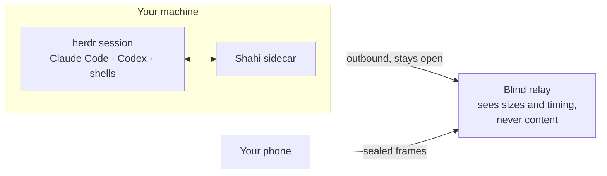

<div align="center">


# Shahi

**Coding agents on your phone.**

Read Claude Code and Codex conversations, answer permission prompts, and manage
agents running in [herdr](https://herdr.dev) from your phone or browser.

[](https://github.com/iYassr/shahi/actions/workflows/ci.yml)
[](LICENSE)


[getshahi.dev](https://getshahi.dev) · [Quick start](#quick-start) ·
[How it connects](#how-it-connects) · [Security](#private-by-design) ·
[Docs](docs/README.md)

</div>

---

## Check on work away from your desk

See which agents are running, finished, or waiting for an answer. Open a
conversation to read what happened and respond from your phone.

<p align="center">
  
  
  
  
</p>
<p align="center">
  <sub><b>Agents</b> — agent status · <b>Reader</b> — conversations ·
  <b>Spaces</b> — workspaces · <b>Connect</b> — scan once</sub>
  <br><sub>Device captures from an earlier build; the current visual system is in the <a href="docs/brand/README.md">brand guidelines</a>.</sub>
</p>

## Quick start

On the machine where herdr runs:

```sh
herdr plugin install iYassr/shahi
herdr plugin action invoke shahi.pair
```

That installs the sidecar as a user service, generates its secrets, and prints a
QR code. Scan it in the app and your agents appear.

There is nothing else to configure — no port to forward, no domain, no reverse
proxy. Reinstalling upgrades in place and keeps your passcode.

No herdr yet? `curl -fsSL https://herdr.dev/install.sh | sh` first — Shahi is a
herdr plugin, so herdr comes first and there is no separate Shahi installer.

> [!NOTE]
> The iOS app is in private testing; there is no public App Store or TestFlight
> link yet. The sidecar, plugin, relay and full source are ready to evaluate
> today. **The browser app supports phones and laptops.** Android remains a future target.

## How it connects

Your machine dials **out** to a relay and holds the connection open. Your phone
dials out to the same relay. Neither side needs an inbound port, and the relay
cannot read what it forwards.



Every frame above the relay is sealed end to end between phone and sidecar
(X25519 → HKDF → ChaCha20-Poly1305), keyed from the pairing secret, which never
travels. The relay multiplexes ciphertext. It can observe IP addresses, server
and device identifiers, connection times, and message sizes and timing.

One alternative, if you would rather have no third party in the path at all:

| Mode | Reach | Set-up |
|---|---|---|
| **Relay** (default) | Anywhere | Scan a pairing QR code |
| **SSH tunnel** | Anywhere you can SSH | Host key pinned on first connect |

`RELAY_URL=` (empty) in the plugin's config opts out of the relay entirely; the
app then reaches the box over SSH. There is no third mode: the sidecar binds
loopback and is never given an address of its own to expose.

## Features

- **Read conversations.** View messages, reasoning, tool calls, patches, files,
  and results from Claude Code and Codex transcripts. Unsupported entries are
  omitted from the reader. Screen mode shows terminal output.
- **Answer permission prompts.** Review a request and choose an answer. The server
  checks that the prompt is still current before sending the response. If parsing
  fails, use the terminal view and text input.
- **Manage agents.** Send messages, attach files, use terminal keys, and start
  agents in your workspaces.
- **Connect to your computer.** Agents run on your computer. Connect through the
  encrypted relay, or use SSH in the mobile app.

## Private by design

Shahi can send commands to your terminal. Access is protected as follows:

- The sidecar binds to loopback and is gated by a passcode.
- Logout invalidates the session on the server, including after a restart.
- Pairing codes are single-use and expire in ten minutes. Each paired device
  gets its own secret and can be revoked — effective on its next request and on
  its open socket.
- The relay is blind: it forwards sealed frames and can observe sizes and
  timing, never content, paths, or keys.
- Secrets live in herdr's per-plugin config directory, never in the checkout.
  On the phone they live in the iOS Keychain.
- Terminal output is never written to logs.

The browser app trusts the code delivered by `getshahi.dev`. A compromised
website or publishing account could read an active session or remembered
pairing secret. Encryption protects against the relay; it cannot protect
against compromised code running on your device. See the
[privacy policy](https://getshahi.dev/privacy) for metadata and push-provider access.

The threat model, the protocol, and what is fixed versus accepted are written
down in the [security review](docs/security-review.md) and
[relay specification](docs/relay.md) — including the parts that are still open.

## Requirements

- A Mac or Linux machine running **herdr 0.8.2+**
- Claude Code, Codex, or any shell running inside it
- An iPhone (Android and a PWA are coming)
- Outbound internet for the default relay — or a server you can SSH into

herdr is the only backend today. tmux is plausible and not built; it is not
advertised as working.

## Development

A native Expo app, a Bun sidecar, a shared wire contract, and a Cloudflare
Worker relay.

```text
mobile/   the native app — the product, and where new work goes
server/   the sidecar: owns herdr's socket, speaks HTTP + WebSocket
shared/   the wire contract, relay protocol, end-to-end encryption
relay/    the blind relay: a Worker, one Durable Object per box
plugin/   the herdr plugin and its service lifecycle
web/      the responsive PWA — maintained alongside the native app
e2e/      Playwright, against a stub of the server
```

```sh
bun install
bun run typecheck
bun test shared/src server web/src plugin   # unit
bun run test:mobile                         # the app
bun run test:e2e                            # both engines, against a stub
bun run test:relay                          # the relay, under wrangler dev
```

Tests run against a stub that records writes instead of performing them, so the
suite can never type into a real session. CI additionally runs the sidecar
against a **real headless herdr** on every push — pinned to 0.8.2 and to
whatever is current — because contract drift is the one thing a stub cannot
notice.

[CLAUDE.md](CLAUDE.md) documents herdr's measured behaviour and the engineering
rules; read [CONTRIBUTING.md](CONTRIBUTING.md) before opening a change.

## Documentation

| | |
|---|---|
| [Brand guidelines](docs/brand/README.md) | Logo, shared colors, typography, and motion |
| [Plugin and pairing](docs/plugin.md) | Install, actions, key bindings, uninstall |
| [Connection options](docs/connectivity.md) | Relay, tailnet, SSH — and how to choose |
| [Relay protocol](docs/relay.md) | The wire format, and running your own |
| [Security review](docs/security-review.md) | Threat model, findings, what is deferred |
| [Operating the sidecar](docs/operations.md) | Service, logs, manual setup |
| [Notifications](docs/notifications.md) | Push, and what is not proven yet |
| [Building on a Mac](docs/on-a-mac.md) | iOS builds and device testing |
| [Privacy policy](docs/privacy-policy.md) | Published at [getshahi.dev/privacy](https://getshahi.dev/privacy) |

## Support

Questions, bug reports and anything the docs do not answer:
**[support@getshahi.dev](mailto:support@getshahi.dev)**, or open an
[issue](https://github.com/iYassr/shahi/issues). Privacy questions go to
[privacy@getshahi.dev](mailto:privacy@getshahi.dev).

If you are reporting something security-sensitive, mail it rather than opening
an issue, and say so in the subject.

---

<div align="center">
<sub>MIT licensed · Shahi was HerdrUI until August 2026 — a phone-shaped window
onto a terminal multiplexer need not be named after one.</sub>
</div>
