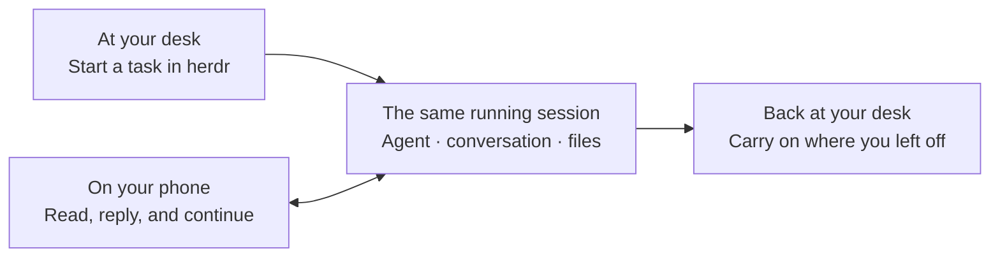
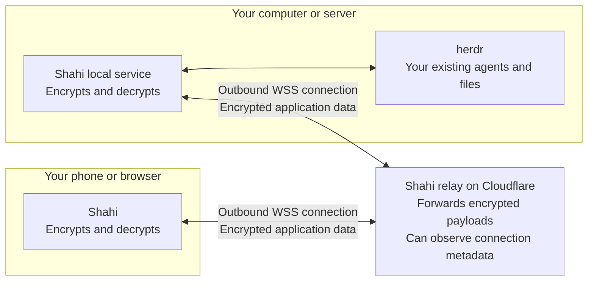

<div align="center">


# Shahi

**Leave your desk. Keep working.**

Continue the same coding-agent sessions from your phone.<br>
Same conversation. Same files. Same computer doing the work.

[](https://github.com/iYassr/shahi/actions/workflows/ci.yml)
[](LICENSE)

[Open Shahi](https://getshahi.dev/pwa/) · [Request an iOS beta invite](https://getshahi.dev/#ios-beta) · [Quick start](#quick-start) · [Connection security](#connection-security)

</div>

## Your work stays where you started it

You start a task with Claude Code or Codex on your computer or server. Then you
step away. An agent needs permission, has a question, or finishes something you
want to review.

Open Shahi on your phone and pick up that same session. Read the conversation,
answer the question, send the next instruction, or open the terminal screen.
When you return to your computer, your replies and the agent’s work are already
there.

**Shahi connects you to the work that is already running.** There is no project
to upload or conversation to recreate. Your agents, files, and commands stay on
your machine, inside [herdr](https://herdr.dev).



Your computer or server must stay awake and connected. Closing Shahi on your
phone does not stop the agents running there.

## Built for using a phone

- **Scan and connect.** The default connection uses a pairing QR code. No Shahi
  account, public server port, VPN installation, or domain setup is needed.
- **Read comfortably.** Conversation view formats messages, code, tool calls,
  and results for a small screen. Screen mode shows the underlying terminal.
- **Keep work moving.** Answer supported permission prompts inline, send a
  follow-up, attach a file, or use terminal keys your phone keyboard lacks.
- **Find what needs you.** The Inbox in Agents gathers unanswered requests,
  completed work, and agents whose status needs checking. Mark completed items
  Reviewed for the current app session.
- **Know when the connection is interrupted.** Connection guidance distinguishes
  reported network, relay, and computer-disconnection problems and offers a
  retry while preserving the last loaded view.
- **Manage your workspaces.** Browse spaces, open existing agents, and start new
  ones on the same machine.

<p align="center">
  
  
  
</p>
<p align="center"><sub>Earlier device captures; some controls and styling have since changed.</sub></p>

## Quick start

### 1. Install on the computer doing the work

You need **herdr 0.9.0 or newer** on macOS or Linux. Linux service installation
requires systemd; see the [installation requirements](docs/plugin.md).
Run your agents inside herdr, then install Shahi:

```sh
herdr plugin install iYassr/shahi
```

The plugin installs Shahi’s local service and generates its credentials. Need
herdr first? Start with [herdr’s installation instructions](https://herdr.dev).

### 2. Show a pairing code

On that same computer:

```sh
herdr plugin action invoke shahi.pair
```

The code can be claimed **once** and expires after **10 minutes**. Generate a
separate code for each phone or browser. Treat the QR code and pairing link as
credentials: anyone who claims a valid code can gain access to your session.

### 3. Open Shahi on your phone

- **Browser:** open [getshahi.dev/pwa/](https://getshahi.dev/pwa/) and scan the QR.
  You can also paste the pairing code or use the browser link printed with it.
  Add Shahi to your home screen for a standalone app window.
- **iPhone app:** [request a TestFlight beta invite](https://getshahi.dev/#ios-beta).
  Once invited, open the app and choose **Scan QR code**. Invitations depend on
  beta availability; the signup form does not immediately grant access.

Pair several computers from **Settings → Computers → Add a computer**. Tap the computer
name on the main screen or in Settings to switch instantly. Every saved computer
keeps its own live connection while Shahi is open; switching only changes the view.
The computer list shows which machines are connected and lets you revoke this
phone or browser’s access to one without disconnecting the others. Mobile operating
systems can suspend connections while the app is in the background; Shahi reconnects
all saved computers when you return.

Your existing agents appear after pairing. Outbound internet access is required
for the default relay connection; you do not need to expose Shahi’s local port.

The browser app is available on phones and computers. The native iOS app is in
beta; a native Android release is not currently available. SSH tunnelling is
built into the native app, not the hosted browser app.

## How it connects

Both your phone and your computer make an **outbound connection** to Shahi’s
relay. That lets them find each other without opening an inbound port on your
computer or configuring your router.

The relay forwards traffic. **Your phone and your computer encrypt and decrypt
the application data.** The relay does not receive the keys needed to read your
conversation, files, or commands.



The arrows show two-way traffic; **both connections are initiated by your own
devices**. The default relay is `relay.getshahi.dev`. You can also
[operate your own relay](docs/relay.md).

Prefer SSH? In the native app, choose **Want to use SSH?** and connect to a
computer you can already reach over SSH. Shahi opens a tunnel to its loopback
service and pins the SSH host key on first connection. Setting `RELAY_URL=`
(empty) in the plugin configuration disables the relay on your computer.

## Connection security

Shahi can operate your terminal, so a paired device has powerful access. Its
connection is designed around a few concrete protections:

| Protection | What it does |
|---|---|
| **End-to-end encryption** | Application payloads are encrypted between your device and your computer, in addition to the WSS transport encryption. The relay forwards ciphertext. |
| **One-time pairing** | A short-lived QR secret introduces a device. Pairing replaces it with that device’s own secret. |
| **Proof before access** | Knowing a device identifier is insufficient. The device must prove possession of its secret with a valid encrypted message before the server grants session access. |
| **Fresh connection keys** | Each connection uses ephemeral X25519 keys. HKDF-SHA-256 mixes the exchange with the pairing or device secret; ChaCha20-Poly1305 protects messages. |
| **Message integrity and ordering** | Altered messages and unexpected counters are rejected rather than accepted as commands. |
| **Device revocation** | Revoke a paired device in Settings to close its active connection and refuse further authenticated requests. |
| **Local service boundary** | The sidecar binds to loopback. Direct access requires a passcode session; relay access uses the paired device’s credentials. |

**Encryption has a boundary.** The relay and its infrastructure provider can
observe connection metadata, including IP addresses, identifiers, and traffic
sizes and timing. A compromised phone, computer, or browser application can
access data at an endpoint. Optional push notifications use separate providers
that receive notification content. Your coding agent’s own model-provider
connection is also separate from Shahi.

The native app stores pairing credentials in the iOS Keychain. Browser pairing
is temporary unless you explicitly choose to remember it; remembered credentials
are accessible to code running on the website’s origin. Trusting the hosted
browser app includes trusting its published code.

**[Read the illustrated security guide →](docs/connection-security.md)**

It explains pairing, encryption, credential storage, metadata, revocation, and
what the published security reviews do—and do not—establish. For data collection
and retention, read the [privacy policy](docs/privacy-policy.md). Report security
issues through [SECURITY.md](SECURITY.md).

## Development

Shahi uses Expo and React Native for mobile, React for the PWA, Bun for the
sidecar, and a Cloudflare Worker for the relay. Both clients share the wire
contract and encryption implementation.

```text
mobile/   Native app
web/      Responsive browser app and PWA
server/   Local service connecting to herdr
shared/   Types, pairing, encryption, and shared client logic
relay/    Encrypted-traffic relay
plugin/   Installation and service management
site/     Public website
e2e/     Browser tests against isolated fixtures
```

```sh
bun install
bun run typecheck
bun run test
bun run test:mobile --runInBand
bun run test:relay
bun run build:web
bun run test:e2e --project=phone --project=ios
bun run build:site
bun run test:hosted
```

Browser tests use fixtures that record actions without sending them to your
agents. Real-herdr checks require an explicitly isolated test session; never
point write tests at your working session. See [CONTRIBUTING.md](CONTRIBUTING.md)
and [CLAUDE.md](CLAUDE.md) for development and service restart instructions.

## Further reading

- [Install, update, and manage the plugin](docs/plugin.md)
- [Pairing and device revocation](docs/pairing.md)
- [Connection security, explained](docs/connection-security.md)
- [Relay protocol and self-hosting](docs/relay.md)
- [Build and test the iOS app](docs/on-a-mac.md)
- [All documentation](docs/README.md)

## Support and license

For questions, email [support@getshahi.dev](mailto:support@getshahi.dev) or
[open an issue](https://github.com/iYassr/shahi/issues). Send vulnerabilities
privately using the [security reporting instructions](SECURITY.md).

Shahi is licensed under the [MIT License](LICENSE).
