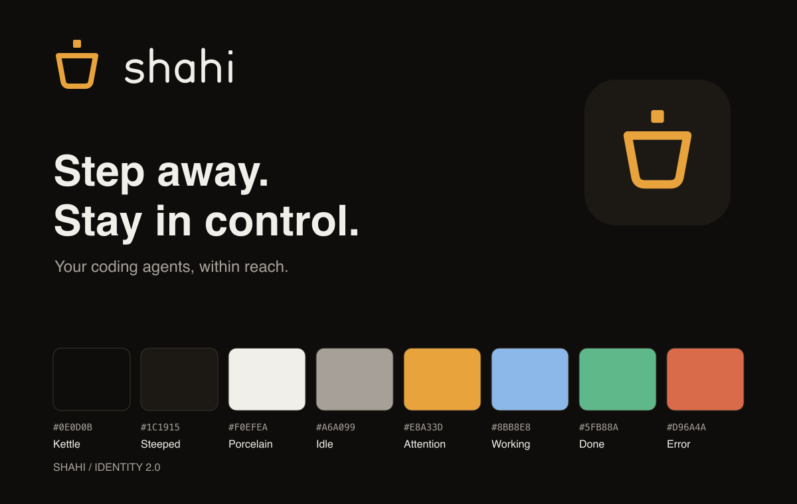

# Shahi identity — 2.0

This identity applies to the native app, browser app, website, and distributed brand assets.

## Promise and voice

**Step away. Stay in control.**

Your coding agents, within reach. Read conversations, answer requests, and keep work moving from your phone.

Shahi feels calm, precise, and approachable. The tea association expresses a moment away from the desk; keep tea language occasional. Use Shahi in prose and the lowercase wordmark in brand lockups. Describe supported agents and capabilities accurately, without implying autonomous work continues when an agent is waiting for input.

| Situation | Voice |
| --- | --- |
| An agent needs input | Needs your answer |
| An action succeeded | Answer sent |
| A connection dropped | Connection lost. Reconnecting… |
| An empty inbox | Nothing needs your attention |
| Pairing | Connect your computer |

Avoid whimsical error messages, urgency without a reason, and claims such as “stores nothing.” Privacy copy must remain aligned with the actual relay and browser behavior.

## Logo

The mark is a broad, tapered tea glass with a square of rising steam that also suggests a terminal cursor. The open interior keeps it legible at small sizes. It has no liquid line, device button, or animated steam.

- Master mark and outlined wordmark geometry: `shared/src/brand.ts`. Native components and generated exports use it directly.
- Amber mark: `../logo.svg`; dark and light monochrome: `mark-dark.svg`, `mark-light.svg`.
- Outlined lowercase lettering: `wordmark.svg` (porcelain), `wordmark-dark.svg` (kettle black); horizontal combinations: `lockup.svg`, `lockup-dark.svg`. Monochrome combinations: `lockup-mono-light.svg`, `lockup-mono-dark.svg`.
- Minimum mark canvas: 16px. Prefer 24–48px in product chrome; at 16px use the mark alone.
- Clear space: at least one cursor square (12 units on the 100-unit canvas) outside the visible drawing.
- Minimum lockup width: 116px. Do not squeeze or independently scale its parts.
- Use amber or porcelain on dark grounds, kettle black on light grounds. Amber is not approved as a small mark on white.
- Keep flat, single-color geometry. Do not add gradients, glows, shadows, extra steam, permanent rotation, or borders around the mark. The brief welcome motion below is the only decorative logo animation. Platform icon materials may be applied by the OS.
- App icons have an opaque kettle-black ground and centered artwork inside the platform safe area. Android foreground and monochrome exports remain transparent.

Run `bun run brand:assets` after geometry or export changes. It regenerates the SVG exports, website wordmark, native and PWA PNG icons, and this overview. The wordmark is outlined; it does not depend on an installed font. Brand lockups use the shared outlined lettering; ordinary in-app headings use the platform sans face for accessibility.

## Color and emphasis

| Name | Hex | Usage |
| --- | --- | --- |
| Kettle black | `#0E0D0B` | Screen ground |
| Surface | `#14120F` | Grouped content |
| Steeped | `#1C1915` | Raised surfaces and selected controls |
| Line | `#2A2620` | Decorative separators |
| Bright line | `#3A352C` | Subtle boundaries |
| Porcelain | `#F0EFEA` | Main text and neutral selection |
| Warm gray | `#A6A099` | Secondary text |
| Tea amber | `#E8A33D` | Brand, primary actions, requests needing attention |
| Working blue | `#8BB8E8` | Agents actively working |
| Sage | `#5FB88A` | Done, successful actions, and connected states |
| Terracotta | `#D96A4A` | Error and destructive states |

Keep most of a screen neutral. Routine tabs and filters use porcelain and a raised surface. A request needing input receives an amber status label and border; an amber button has kettle-black text. A destructive action uses terracotta plus an explicit verb. Pair every state color with text or a recognizable symbol. Agent-provider logos retain their own identity colors and must not stand in for task status.

`shared/src/brand.ts` owns the palette. Native maps it in `mobile/src/lib/theme.ts`; `bun run brand:assets` exports it to `web/public/identity.css`, shared by the browser app, website, and privacy page. Edit the shared palette and regenerate instead of changing exported colors. See [Web identity implementation](web-identity.md). Working is blue, done is green, idle/unknown is warm gray, and needs-input is amber across every client. Show errors in terracotta; do not make a normal completed task look like a failure.

At full opacity on Steeped, calculated contrast ratios are porcelain 15.21:1, warm gray 6.76:1, amber 8.12:1, working blue 8.44:1, sage 7.26:1, and terracotta 5.10:1. These exceed 4.5:1 for ordinary text. Recheck against the actual surface and opacity. Decorative line tokens are intentionally subtle: do not use them as the sole signal for focus, essential control boundaries, or status. Focus uses a visible amber outline. The palette is for dark surfaces; a future light theme requires separately verified text and interaction colors.

## Type, layout, and motion

- Website: IBM Plex Sans for prose and UI, IBM Plex Mono for technical snippets. Product: native system sans and system monospace, with no font download needed to connect.
- Use sans for conversation, buttons, filters, headings, and answer choices. Use mono for code, paths, commands, identifiers, and compact technical metadata.
- Body and answer text: 16px or larger when space permits; controls: 14–16px; secondary metadata: 12–13px. Keep technical content readable without rewriting terminal output.
- Use sentence case. Reserve tracked capitals for short, infrequent status or section labels.
- Spacing rhythm: 4, 8, 12, 16, 24, 32. Default screen gutter: 16px. Cards: 10–14px corners; pills only for short filters and status.
- Preserve 44px touch targets. Allow labels to grow with text size. Focus and selected states must remain visible independently of color.
- Use the existing Lucide/SF Symbols navigation family. The logo is an identity asset, not a substitute for functional icons.
- Keep transitions short and quiet. Agent-avatar bob: lift 3px and scale to 1.06 over 420ms, then return over 420ms. Animate working agents only; waiting requests stay still. Honor Reduced Motion; do not blink for attention.

## Applied examples and release checks

- Website: headline, outlined wordmark, amber glass, restrained agent-inbox example.
- Connect: Shahi mark and a sans heading followed immediately by connection controls.
- Agent list: neutral filters; amber retained for the request needing an answer.
- Approval: readable sans choices with explicit labels; no color-only decisions.
- Home-screen icon: amber glass on kettle black, with matching PWA and native exports.

Review the icon at 16, 24, and 48px and on a device home screen. Check text enlargement and contrast after changing a surface or opacity. Build both web targets and typecheck native before release. Native icon changes require a new native build. Existing screenshots are historical product captures; replace them with real updated device captures for the next store release, never retouch their UI.

## Delight and welcome motion

Controls compress slightly when pressed, selected pins settle once, and transient feedback arrives softly. Hover may raise a neutral surface; the Shahi mark never gains a glow or halo. The conversation and terminal never receive entrance or layout animations. Reduced Motion disables automatic decorative animation. Keep status announcements accessible; motion never substitutes for feedback text.

On the first visible appearance in a session, the Shahi mark lifts up to 6px and gently rocks, settling within 1.2 seconds. It plays once per browser tab session or native app launch, never blocks interaction, and is skipped with Reduced Motion. Navigating between screens or returning from the background must not repeat it. Provider avatars retain their separate working animation.

The website offers a labeled replay button beside the wordmark. Explicitly replaying opts into that one greeting even with Reduced Motion enabled; automatic playback remains disabled. Decorative motion never triggers a network action. The website's answer interaction is an explicitly labeled local preview, not a real approval.
