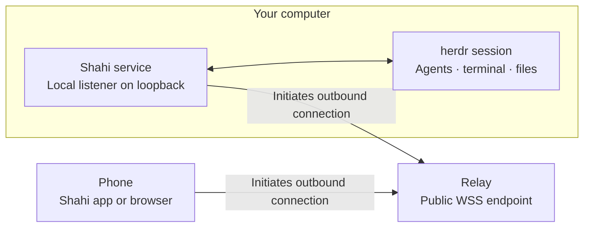
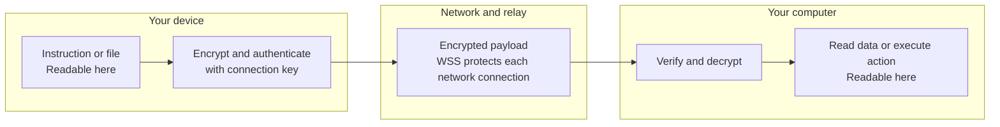

# How Shahi connects securely

Shahi lets your phone control the same agent sessions you use on your computer.
That includes sending instructions and operating a terminal. The connection
must protect both **what you read** and **what your computer is asked to do**.

The default flow is simple: install the plugin, scan a QR code, and connect.
This guide explains the security behind that flow and where its protection ends.

## 1. Your computer stays behind its existing network boundary

Your computer runs a small Shahi service beside herdr. That service listens on
loopback for local access and connects outbound to the relay. Your phone also
connects outbound to the relay.

You do not need to publish the local Shahi port, set up a domain, or forward a
port on your router. Both devices still need network access to the relay, and
your computer must remain awake with its services running.



Once established, these connections carry traffic in both directions. The relay
provides reachability; it does not need to understand your commands or files.

## 2. Scanning the QR introduces a specific device

The QR carries the relay address, your server’s identifier, and a random
**32-byte pairing secret**. Your computer keeps the corresponding temporary
pairing record. A code expires after ten minutes and can be claimed once.

```mermaid
sequenceDiagram
  participant Computer as Your computer
  participant Phone as Your phone
  participant Relay as Relay
  Computer->>Computer: Generate a temporary pairing secret
  Computer-->>Phone: Show QR; you scan it directly
  Phone->>Relay: Connect and send public handshake data
  Relay->>Computer: Forward the handshake
  Computer-->>Phone: Return ephemeral public key through relay
  Note over Phone,Computer: Both derive keys using the QR secret and fresh key exchange
  Phone->>Computer: Check server identity and claim code through encrypted channel
  Computer->>Computer: Consume code and create device credentials
  Computer-->>Phone: Return device secret through encrypted channel
  Note over Phone,Computer: Future connections use the device secret, not the QR code
```

In this diagram, messages after the initial scan travel through the relay; the
phone does not open a direct network connection to the computer.

The initial handshake exposes public keys and a pairing-code hash or device
identifier. It does **not** expose the pairing or device secret in plaintext.
The QR is the private introduction between the two endpoints.

**Treat the QR and pairing link as credentials.** Anyone who obtains and claims
a still-valid code can pair a device. Expiration and single use reduce the
window of exposure; they do not make a screenshot of an unused code safe to
share. Browser pairing links put the code in a URL fragment, which is not sent
in the HTTP request. The browser app consumes and removes that fragment, but
code running in the browser can read it while present.

## 3. Encryption happens before traffic reaches the relay

There are two separate layers:



**Transport encryption (WSS/TLS)** protects the network connections to
Cloudflare. TLS terminates at the infrastructure provider, so TLS alone would
not hide application content from that provider.

**Shahi’s end-to-end encryption** protects the application payload inside those
connections. The device and sidecar derive the keys; the relay receives the
resulting ciphertext.

The implementation uses:

- **Ephemeral X25519** for a fresh key exchange on each connection.
- **HKDF-SHA-256** to derive separate keys for each direction, combining the
  exchange with the pairing secret or established device secret and binding
  the derivation to both public keys.
- **ChaCha20-Poly1305** for authenticated encryption of each application message.
- **Per-direction counters** to reject altered, replayed, or out-of-order
  messages. A missing message causes the next counter check to fail rather
  than silently accepting a gap. A relay can still delay traffic or disconnect
  either side.

A device identifier alone grants no access. The sidecar requires a valid sealed
message proving possession of the secret within fifteen seconds before issuing
a device session or attaching its stream. Pairing connections are limited to
checking server metadata and claiming the code.

The sidecar also proves its server identity to the relay with an Ed25519
challenge signature. This protects registration of the server identifier at the
relay; it is distinct from the shared-secret proof that protects device access.

The source of these behaviors is [the encryption implementation](../shared/src/e2e.ts),
[the relay client](../shared/src/relay-client.ts), and
[the sidecar’s relay handler](../server/lib/relay-client.ts). The complete wire
format is in the [relay specification](relay.md).

## 4. What each part can see

| Part | Access and visibility |
|---|---|
| Your phone or browser | Decrypted conversations, files, commands, and the credentials needed for its session. |
| Your computer and Shahi service | Decrypted requests and results; local files, agent transcripts, and device credentials needed to authorize access. |
| Relay and Cloudflare infrastructure | Connection metadata such as IP addresses, public server/device identifiers, public handshake values, connection times, and traffic sizes and timing. Application payloads remain encrypted. |
| Optional push providers | Notification content sent through their separate delivery path. Native push uses Expo and the platform provider; web push uses the browser’s provider. |
| Your agent’s model provider | Whatever the agent itself sends under its own configuration. Shahi’s relay encryption does not change that separate connection. |

The relay is not a conversation-history service. It forwards frames and does
not retain a transcript for later delivery. Shahi does collect operational
metadata for reliability and abuse diagnosis. “Encrypted” does not mean
“anonymous” or “no telemetry.” See the [privacy policy](privacy-policy.md) for
specific fields, providers, and retention periods.

## 5. You can remove a device’s access

In **Settings → Paired devices**, revoke the phone or browser you no longer
trust. The sidecar refuses further authenticated requests and closes its active
relay connections. A revoked device needs a fresh pairing code to return.

Revocation cannot undo a command already accepted or remove data the device
already downloaded. Review devices before lending or disposing of a phone.

Native pairing credentials are stored in the **iOS Keychain**. Browser pairing
is memory-only by default; choosing to remember the connection stores its
credentials in browser storage on that profile. Signing out clears the relevant
client connection state, and server-side session logout is enforced across
sidecar restarts.

## 6. What you still need to trust

- **Your endpoints.** Encryption cannot hide data from malicious software on the
  phone or computer where it is decrypted. A paired device can operate your
  terminal with your user’s access; pairing is not a read-only permission.
- **The application you run.** With the hosted PWA, code published on
  `getshahi.dev` can access an active session and remembered browser credentials.
  A compromised website, publishing account, or sufficiently privileged browser
  extension could cross this boundary. Native builds also require a trusted
  distribution and update path.
- **Network availability.** A relay can refuse, delay, or drop connections even
  when it cannot decrypt their content. Shahi cannot keep a sleeping or
  disconnected computer available.
- **Implementation quality.** Established cryptographic primitives do not make
  their integration automatically correct. The published project reviews are
  internal assessments of specific revisions, not an independent security
  audit or certification. Read their scope and remediation status in the
  [review index](README.md#historical-reviews).

## Prefer a different connection path?

The native app can open an **SSH tunnel** to a computer you can already reach
over SSH. The tunnel carries local Shahi traffic without using the Shahi relay.
SSH host keys are pinned on first connection; verify the first connection’s host
identity through a trusted source. SSH access also requires the Shahi passcode.

Set `RELAY_URL=` (empty) in the plugin configuration to stop your computer from
connecting to the default relay. Alternatively, [run your own relay](relay.md)
to control its infrastructure and operational metadata. Self-hosting does not
remove the need to trust your endpoints and application code.

For security-sensitive reports, follow [SECURITY.md](../SECURITY.md).
